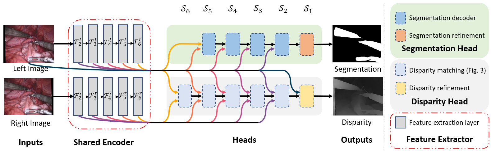
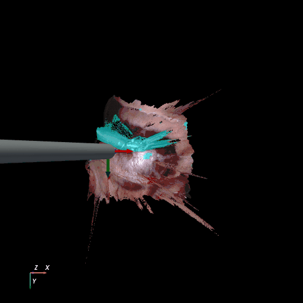
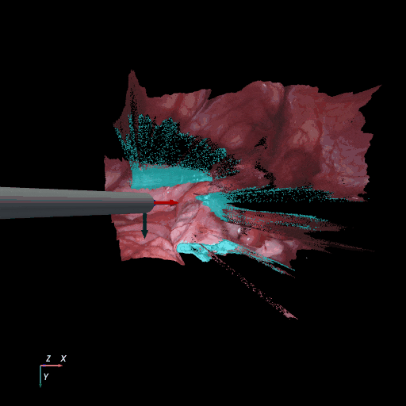

# MSDESIS: Multi-task stereo disparity estimation and surgical instrument segmentation

## Overview

### Introduction

Reconstructing the 3D geometry of the surgical site and detecting instruments within it are important tasks for surgical navigation systems and robotic surgery automation. Traditional approaches treat each problem in isolation and do not account for the intrinsic relationship between segmentation and stereo matching. In this paper, we present a learning-based framework that jointly estimates disparity and binary tool segmentation masks. The core component of our architecture is a shared feature encoder which allows strong interaction between the aforementioned tasks. Experimentally, we train two variants of our network with different capacities and explore different training schemes including both multi-task and single-task learning. Our results show that supervising the segmentation task improves our network’s disparity estimation accuracy. We demonstrate a domain adaptation scheme where we supervise the segmentation task with monocular data and achieve domain adaptation of the adjacent disparity task, reducing disparity End-Point-Error and depth mean absolute error by 77.73% and 61.73% respectively compared to the pre-trained baseline model. Our best overall multi-task model, trained with both disparity and segmentation data in subsequent phases, achieves 89.15% mean Intersection-over-Union in RIS and 3.18 millimetre depth mean absolute error in SCARED test sets. Our proposed multi-task architecture is real-time, able to process (1280x1024) stereo input and simultaneously estimate disparity maps and segmentation masks at 22 frames per second.

### Architecture


The architecture of our multi-task framework with both heads attached. Left and right rectified images are processed by the shared  feature  encoder  which  outputs  feature  maps Fi at  different  scales Si.  Those  features  are  inputs  to  each  task  specific sub-network (head) which make the final predictions. The modular design allows us to interchange or remove part of the network.

### Reconstructed output

|SCARED Dataset 8 Keyframe 4 | RIS Dataset d keyframe 264 |
|:----------------------------:|:----------------------------:|
||

3D reconstruction of SCARED and RIS2017 samples based on the output of our method. Disparity predictions are reconstructed in 3D and binary tool segmentation masks are used to color tool points in shades of cyan.
A virtual camera follows a circular trajectory around the endoscope to show details of the final outcome. The model used to estimate both the segmentation and disparity is the light-phase3-multi2seg.

### Additional resources

We provide 2 unofficial toolkits to generate disparity samples for SCARED and
stereo rectify the RIS2017 dataset  which you will need if you want to reproduce
that come with this repository.
Please visit the repositories bellow:

- [Unofficial SCARED toolkit](https://github.com/dimitrisPs/scared_toolkit)
- [Unofficial RIS2017 toolkit](https://github.com/dimitrisPs/ris2017_toolkit)

### Cite

If you are using this model or any of the provided code for your research, consider citting our work.

```cite
@ARTICLE{9791423,
  author={Psychogyios, Dimitrios and Mazomenos, Evangelos and Vasconcelos, Francisco and Stoyanov, Danail},
  journal={IEEE Transactions on Medical Imaging}, 
  title={MSDESIS: Multi-task stereo disparity estimation and surgical instrument segmentation}, 
  year={2022},
  volume={},
  number={},
  pages={1-1},
  doi={10.1109/TMI.2022.3181229}}
```

## table of contents

- [MSDESIS: Multi-task stereo disparity estimation and surgical instrument segmentation](#msdesis-multi-task-stereo-disparity-estimation-and-surgical-instrument-segmentation)
  - [Overview](#overview)
    - [Introduction](#introduction)
    - [Architecture](#architecture)
    - [Reconstructed output](#reconstructed-output)
    - [Additional resources](#additional-resources)
    - [Cite](#cite)
  - [table of contents](#table-of-contents)
  - [Setup](#setup)
    - [Setup your environment](#setup-your-environment)
    - [Download and process the datasets](#download-and-process-the-datasets)
    - [Pre-trained models](#pre-trained-models)
  - [How to run the code](#how-to-run-the-code)
    - [Inference](#inference)
      - [csv list of inputs](#csv-list-of-inputs)
      - [csv inference](#csv-inference)
      - [Run inference on stereo Videos](#run-inference-on-stereo-videos)
    - [Evaluation](#evaluation)
      - [Evaluate on RIS 2017](#evaluate-on-ris-2017)
      - [Evaluate on SCARED](#evaluate-on-scared)
    - [Training](#training)
      - [Disparity training](#disparity-training)
      - [Multitask training](#multitask-training)
      - [Segmentation training](#segmentation-training)

## Setup

### Setup your environment

We used Anaconda to handle dependences. Assuming that you have anaconda already
installed on your machine, use the following command to create a conda environment
suitable to run our code.

```bash
conda create -n msdesis --file requirements.txt -c conda-forge pytorch

```

### Download and process the datasets

### Pre-trained models

You can download all the models  from [here](https://liveuclac-my.sharepoint.com/:u:/g/personal/ucabdps_ucl_ac_uk/EXW91UYsNNJOpK67Y2Md9WABpvjZa6aBkWBKUa14HEoOnw?e=x1Ap04).

unpack the zip and rename, rename the extracted folder to `weights` and place to
under in the root directory of this repository.

## How to run the code

### Inference

The repository provide a number of inference scripts to facilitate application
of our method providing different ways to feed the network with data.

#### csv list of inputs

The `inference_csv.py` script that reads a csv file containing the input stereo
rectified frames as well as the desired location to store the output disparities
and binary tool segmentation masks. You can use the `create_io_csv.py` script to
create those input .csv files.

To create the input .csv file using the `create_io_csv` script run the following
command

```bash
python -m inference_scripts.create_io_csv left_dir right_dir [--out_path] [--disparity_out_dir] [--segmentation_out_dir]
```

- `left_dir` directory where all the left rectified frames are stored
- `right_dir` directory where all the right rectified frames are stored
- `--out_dir` path to store the output .csv file, default = paths.csv
- `--disparity_out_dir` directory under which the output disparities predictions will be stored.
- `--segmentation_out_dir` directory under which the output segmentation predictions will be stored.

`--disparity_out_dir` and `--segmentation_out_dir` indicate only the destination
directory under which the output will be stored. The outputs will have the same name
as the left sample.

`left_dir` and `right_dir` point to the directory inputs samples are stored. The
script searches for .png files and sorts them. For the script to work properly make
sure your input files are .pngs and for every .png files in left directory their
is a corresponding .png file in the right rectory.

#### csv inference

```bash
python -m inference_scripts.inference_csv root_input_path root_output_path filelist_path model_type model_weights [--mode] [--cuda_id] [--segmentation_threshold] [--disparity_scale_factor] [--combine] [--jobs] [--use_amp]
```

- `root_input_path` Path to append add in front of all input paths in csv
- `root_output_path` Path to append add in front of all output paths in csv
- `filelist_path` The path to .csv file containing input and output paths
- `model_type` Encoder type to use, coices=['light', 'resnet34'], default = 'light'
- `model_weights` Path to model weights
- `--mode` Mode to run the multitask network, choices=['multitask', 'segmentation', 'disparity'], default='multitask'
- `--cuda_id` Cuda device to use', default=0
- `--segmentation_threshold` Segmentation binary threshold', default=0.5
- `--disparity_scale_factor` Disparity scale factor to multiply the original disparity before saving in as uint16 .png, default=128.0
- `--jobs` Number of concurent works used to save output images.
- `--use_amp` Run inference in float16. To use this you need an AMP enabled GPU

Good to Know:

- For this script to work you need to make sure that the input samples are rectified.
- The script does not pad the inputs, you need to make sure that the dimensions
of the input samples can be divided by 32.

#### Run inference on stereo Videos

```bash
python -m inference_scripts.inference_videos video_path out_path model_type [--max_disparity] [--mode] [--cuda_id] [--segmentation_threshold] [--disparity_scale_factor] [--calib] [--rectification_alpha] [--stacking]
```

This script allows you to run inference directly on a video and export the results
to a video making easy qualitative visualization. The script is very versatile
and can rectify videos on the fly as long as the stereo calibration parameters are
provided.

- `video_path` Path to input stereo video
- `out_path` Path to save video showing the network's output
- `model_type` Type of encoder to use, choices=['light', 'resnet34'] default='light'
- `model_weights` Path to model weights
`--max_disparity` Maximum disparity search range, default=320. For our 2D network this values should be the same as the one used during training
- `--mode` Mode to run the multitask network, choices=['multitask', 'segmentation', 'disparity'], default='multitask'
- `--cuda_id` Cuda device to use', default=0
- `--segmentation_threshold` Segmentation binary threshold, default=0.5
- `--disparity_scale_factor` Disparity scale factor to multiply the original disparity, default=1, because we save the output as a video and not as png, this is only useful when the disparity range is over 255
- `--calib` Path to stereo calibration .json file, to stereo rectify the input video. If this
is not set, the input video is considered rectified and its frames are fed directly to the network
- `--rectification_alpha` Stereo rectification alpha to use in the stereo rectification, default=-1.0
- `--stacking` Specify if left and right stereo frames are stacked horizontally or vertically in the input video, choices=['horizontal', 'vertical'], default='horizontal'
- `--save_images` Wherether to save images instead of video, default=False

### Evaluation

The following scripts can be used to evaluate the performance of the network
in RIS2017 and SCARED datasets. None of those scripts are from the original authors
of those datasets. The scripts output a summary of performance, similar to what
is reported in the target dataset. Both scripts use the network to process input frames
and then compare the outputs with the reference samples from the dataset.

#### Evaluate on RIS 2017

For the following script to work you need to have a copy of RIS dataset and configure
the `datasets/dataset_paths.json` file.

```bash
python -m evaluation_scripts.evaluate_ris model_type model_weights --save_predictions --csv --cuda_id --segmentation_threshold
```

- `model_type` Encoder type to use, choices=['light', 'resnet34'], default='light'
- `model_weights` Path to model weights
- `--save_predictions` Directory to save network output,  if not specified, the script will only save the score.
- `--csv` Path to save evalution scores, default='./ris17_scores.csv'
- `--cuda_id` Cuda device to use, default=0
- `--segmentation_threshold` Segmentation binary threshold, default=0.5

#### Evaluate on SCARED

For the following script to work you need to have a rectified  copy of SCARED dataset
with disparity and configure the `datasets/dataset_paths.json` file. To generate
disparity such dataset have a loot at [scared-toolkit](https://github.com/dimitrisPs/scared_toolkit)

The script can evaluate both disparity and optionally depth-maps. However results
computed from this script are not compatible with the SCARED evalutation
protocol and do not correspond to the figures in our paper. To recreate results 
from the paper you need to produce disparity images using the inference_csv script
convert those to original depth and compute the error against the provided ground truth
using the `scared-toolkit`. The `scared-toolkit` repository provides code to convert
disparity back to original frame of reference and evaluation code that rejects
low coverage frames.

To evaluate **loosly** on SCARED:

```bash
python -m evaluation_scripts.evaluate_scared model_type model_weights --save_predictions --csv --cuda_id --segmentation_threshold --disparity_scale_factor --depth
```

- `model_type` Encoder type to use, choices=['light', 'resnet34'], default='light'
- `model_weights` Path to model weights
- `--save_predictions` Directory to save network output, if not specified, the script will only save the score.
- `--csv` Path to save evalution scores, default='./scared_scores.csv'
- `--cuda_id` Cuda device to use, default=0
- `--segmentation_threshold` Segmentation binary threshold, default=0.5
- `--disparity_scale_factor` Disparity scale factor to multiply the original disparity before saving it as 16bit .png, default=128
- `--depth` Calculate depth mean absolute error

### Training

There are three main training scripts for Disparity, Segmentation and Multitask training.
We use json files to configure hyperparameter and pass those as arguments when running the scripts.
To recreate our results you can use the configuration scripts provided under the `/training_configs/` directory.

#### Disparity training

- Phase 1:  You will need a copy of the FlyingThings3D subset available [here](https://lmb.informatik.uni-freiburg.de/resources/datasets/SceneFlowDatasets.en.html). To recreate results you only have to download the rgb images and the disparity ground truth files. You will also need to modify the `flyingthings3d` entry of the `datasets/dataset_paths.json` file to point to the root folder of your FlyingThings3D dataset.
- phase 2-3: To train the network in the scared dataset you will need to download scared and create a keyframe only subset. Instructions and tools on how to do that can be found [here](https://github.com/dimitrisPs/scared_toolkit). It is important to note that during training we did not use the provided ground truth files because those occasionally have extreme outliers. To recreate the paper's results consider manually cleaning the provided pointcloud of obvious outliers before generating the disparities. In addition when generating disparities you need to use a scale factor of 128. As was the case with Flyingthings3D, you will need to modify the `scared` entry of the `datasets/dataset_paths.json` file to point to the root folder to the manipulated SCARED dataset.
Additionally you need to train the previous phase model or download their corresponding 
weights.

The folder structure of the SCARED keyframe data should look like this:

```tree
keyframe_scared               //root directory, scared needs to point to.
    ├── disparity  //disparity directory, disparities are stored using a scale factor of 128
    │   ├── 1_1.png          //{dataset_number}_{keyframe_number}.png
    │   ├── :
    │   └── 7_5.png
    ├── left_rectified            // left rectified image directory
    │   ├── 1_1.png
    │   ├── :
    │   └── 7_5.png
    └── right_rectified           //right rectified image directory
       ├── 1_1.png
       ├── :
       └── 7_5.png
```

```bash
python -m training_scripts.train_disparity --default_config --cuda_id
```

`--default_config` .json file containing hyperparameter configuration
`--cuda_id` gpu number you want to use, default=0

#### Multitask training

To recreate the paper's results you will need to have a ph1 disparity model to train the multitask model, or download the pretrained models.
Additionally you will need to have a stereo rectified version of the RIS 2017 dataset. Tools and instructions on how to get one can be found [here](https://github.com/dimitrisPs/ris2017_toolkit).
After you have a stereo rectified copy of the RIS, you will then need to modify the `ris17_124` entry of the `datasets/dataset_paths.json` file to point to the train subset of the the stereo rectified RIS.
This should follow the file structured shown bellow:

```tree
stereo_rectified_ris_train        //root directory, ris17_124 needs to point to.
    ├── instrument_dataset_1
    │   ├── ground_truth
    │   │   └── binary
    │   │       ├── frame000.png //frame{frame_number}.png
    │   │       ├── :
    │   │       └── frame224.png
    │   ├── left_frame
    │   │   ├── frame000.png
    │   │   ├── :
    │   │   └── frame224.png
    │   └── right_frame
    │       ├── frame000.png
    │       ├── :
    │       └── frame224.png
    ├── instrument_dataset_2
    ├── instrument_dataset_3
    ├── instrument_dataset_4
    ├── instrument_dataset_5
    ├── instrument_dataset_6
    ├── instrument_dataset_7
    └── instrument_dataset_8
```

```bash
python -m training_scripts.train_multitask --default_config --cuda_id
```

`--default_config` .json file containing hyperparameter configuration
`--cuda_id` gpu number you want to use, default=0

Good things to know:

- To train with mixed precision you need to remove the type assertions in kornia's loss functions.

#### Segmentation training

To recreate the paper's results, you will need to have a ph1 disparity model to train the ph2 segmentation model and a ph2 multitask model to train the ph3 segmentation model.
Again for the training scripts to work you need to have a copy of RIS. In our experiments we de-interlaced, cropped and resized the provided samples. Tools to do that are provided [here](https://github.com/dimitrisPs/ris2017_toolkit). Additionally you will need to modify the `ris17_train_monocular` entry of the `datasets/dataset_paths.json` file to point to the train subset of the training RIS set. The file structure of the monocular ris should be the same as the stereo rectified one.

```bash
python -m training_scripts.train_segmentation --default_config --cuda_id
```

`--default_config` .json file containing hyperparameter configuration
`--cuda_id` gpu number you want to use, default=0
